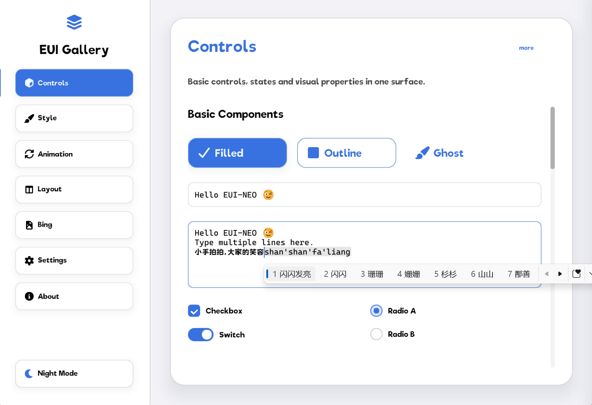
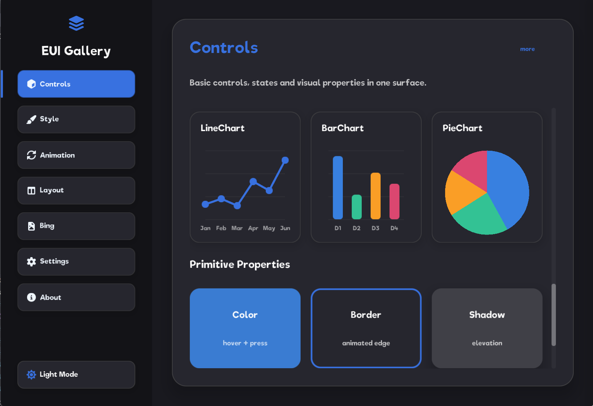
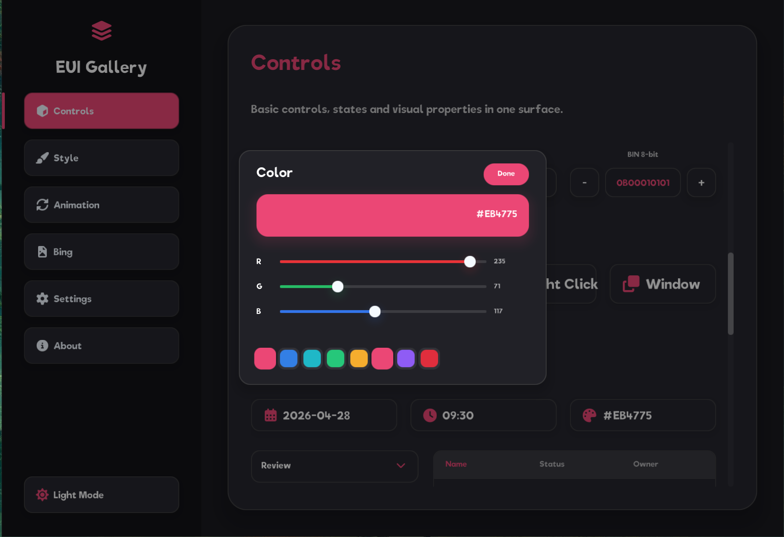
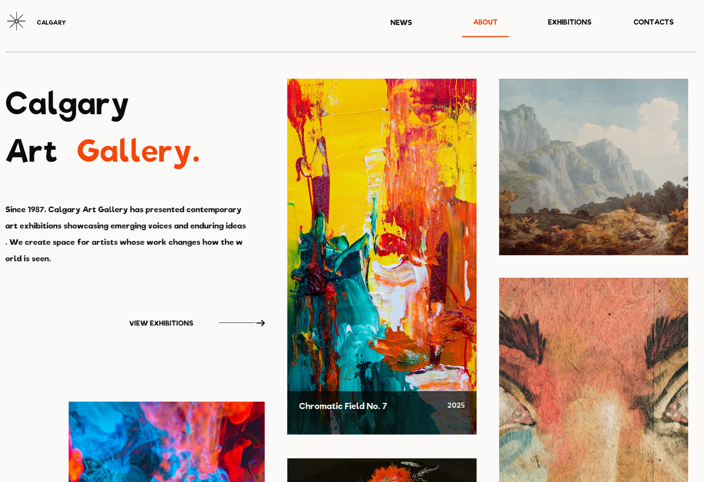
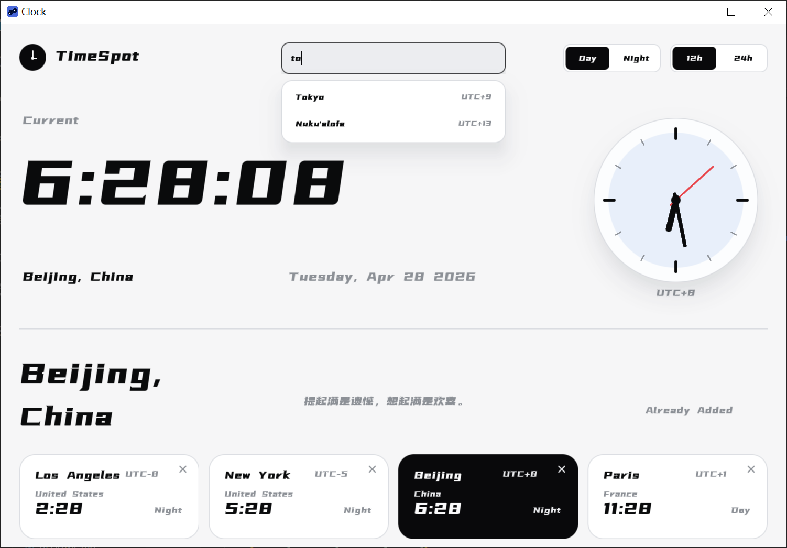
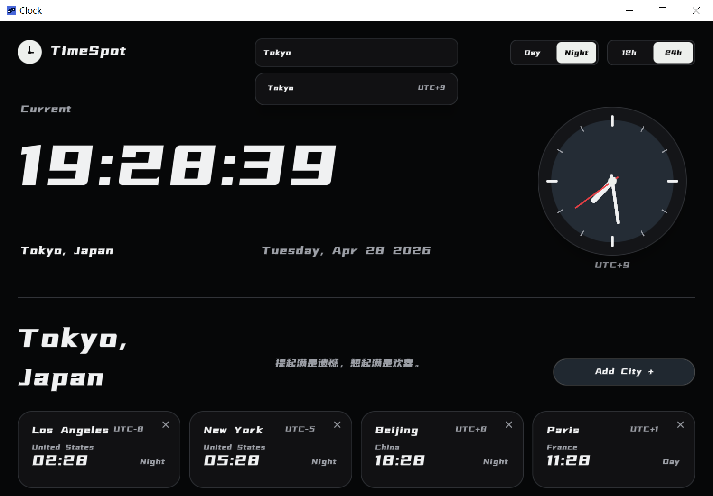

# EUI-NEO

<p align="center">
  
</p>

<p align="center">
  <a href="https://github.com/sudoevolve/EUI-NEO/releases"></a>
  <a href="LICENSE"></a>
  
  
  
  
  <a href="https://github.com/sudoevolve/EUI-NEO/stargazers"></a>
</p>

<p align="center">
  <a href="README.md">English</a>
  ·
  <a href="https://sudoevolve.github.io/EUI-NEO/">官网</a>
  ·
  <a href="https://atomgit.com/sudoevolve/EUI-NEO">AtomGit镜像</a>
</p>

EUI-NEO 是一个基于 C++17 的跨平台高性能轻量级 UI 框架，支持 GLFW/SDL2 窗口后端和 OpenGL/Vulkan 渲染后端。

## 预览

|                               |                               |
| ----------------------------- | ----------------------------- |
|   |   |
|   |   |
|  |  |

## 快速开始

环境要求：

- CMake 3.14+
- 支持 C++17 的编译器：MSVC 19.29+（Visual Studio 2019 16.11+）、GCC/MinGW-w64 12+ 或 Clang 14+
- 默认渲染器所需的 OpenGL 开发文件

把 EUI-NEO 放到 `3rd/EUI-NEO`，然后创建：

如果 GitHub 拉取失败，再使用 AtomGit 国内镜像：

```sh
git clone https://atomgit.com/sudoevolve/EUI-NEO.git 3rd/EUI-NEO
```

```cmake
cmake_minimum_required(VERSION 3.14)
project(MyProject LANGUAGES C CXX)

set(CMAKE_CXX_STANDARD 17)
set(CMAKE_CXX_STANDARD_REQUIRED ON)

add_subdirectory(3rd/EUI-NEO)

add_executable(my_app main.cpp)
eui_neo_configure_app(my_app)
```

`main.cpp`：

```cpp
#include "eui_neo.h"

namespace app {

const DslAppConfig& dslAppConfig() {
    static const DslAppConfig config = DslAppConfig{}
        .title("My App")
        .pageId("my_app")
        .windowSize(960, 640);
    return config;
}

void compose(eui::Ui& ui, const eui::Screen& screen) {
    ui.column("root")
        .size(screen.width, screen.height)
        .padding(32.0f)
        .content([&] {
            ui.text("title")
                .text("Hello EUI-NEO")
                .fontSize(28.0f)
                .build();
        })
        .build();
}

} // namespace app
```

构建：

```sh
cmake -S . -B build -DCMAKE_BUILD_TYPE=Release
cmake --build build --config Release --parallel
```

Windows 使用 Visual Studio 生成器时运行：

```powershell
.\build\Release\my_app.exe
```

Linux 或 macOS 运行：

```sh
./build/my_app
```

`eui_neo_configure_app()` 会加入所选 GLFW/SDL2 入口、链接 `eui::neo`、设置平台可执行文件选项并部署运行资源。应用不需要引用 `core/` 下的文件。

Release SDK 使用同一套目标配置：

```cmake
find_package(EuiNeo CONFIG REQUIRED)
add_executable(my_app main.cpp)
eui_neo_configure_app(my_app)
```

安装、`FetchContent` 和 SDL2/Vulkan 选择见 [集成指南](docs/集成指南.md)。构建本仓库和平台依赖见 [开发与发布](docs/开发与发布.md)。

## 可选模块

可选功能模块位于 `modules/`，详细说明见 [模块指南](docs/模块.md)。

## 目录结构

```text
assets/       字体、PNG、SVG 和图标等运行资源
components/   基于 DSL 封装的通用组件
core/         DSL、Runtime、图元、文本、图片、网络和平台能力
docs/         项目实现文档
examples/     短小、单页面的 API 演示
modules/      键盘、串口等可选功能模块
apps/         代码较长或多页面应用；每个应用使用独立目录和 app.cpp
include/      公共 include 路径：eui_neo.h 和 eui/* facade 头文件
tests/        probe 源码、fixture 应用和本地 benchmark 记录
3rd/          内置第三方构建源码和单文件依赖
```

## Docs

- [DSL 设计与当前实现](docs/DSL.md)
- [组件](docs/组件.md)
- [模块](docs/模块.md)
- [状态模型](docs/状态.md)
- [布局](docs/布局.md)
- [事件](docs/事件.md)
- [动画](docs/动画.md)
- [异步](docs/异步.md)
- [渲染后端架构与流程](docs/渲染后端架构.md)
- [保留层缓存](docs/retained_layer_cache.md)
- [图片](docs/图片.md)
- [网络](docs/网络.md)
- [平台能力](docs/平台能力.md)
- [集成指南](docs/集成指南.md)
- [Shadertoy 底层图元](docs/Shadertoy.md)
- [开发与发布](docs/开发与发布.md)

## 许可

EUI-NEO 的原创源码采用 Apache License 2.0。`3rd/` 下的第三方代码、CMake 可选联网拉取的构建期依赖，以及 `assets/` 下随项目分发的字体和图标字体，遵循各自上游许可证和版权声明。

## 贡献者致谢

感谢所有为 EUI-NEO 提交代码、完善文档、报告问题和提供建议的贡献者。

<a href="https://github.com/sudoevolve/EUI-NEO/graphs/contributors">
  
</a>
